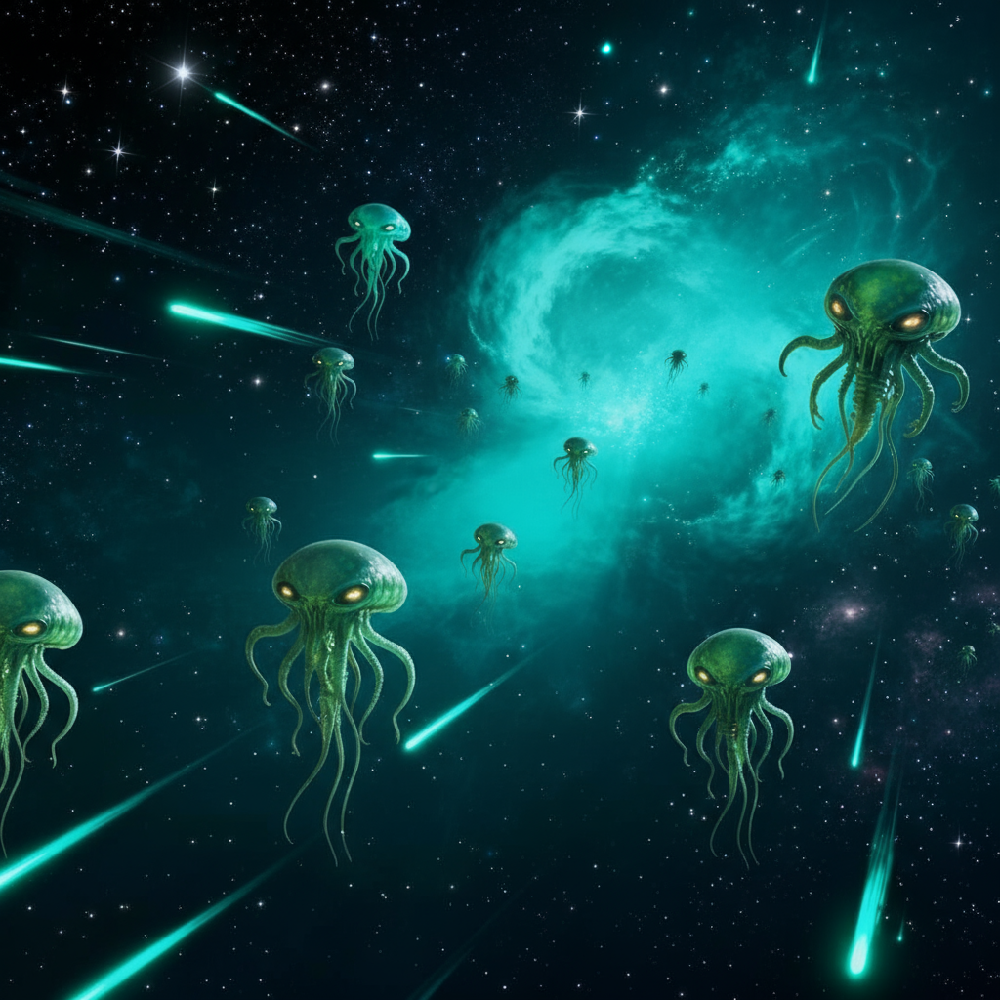
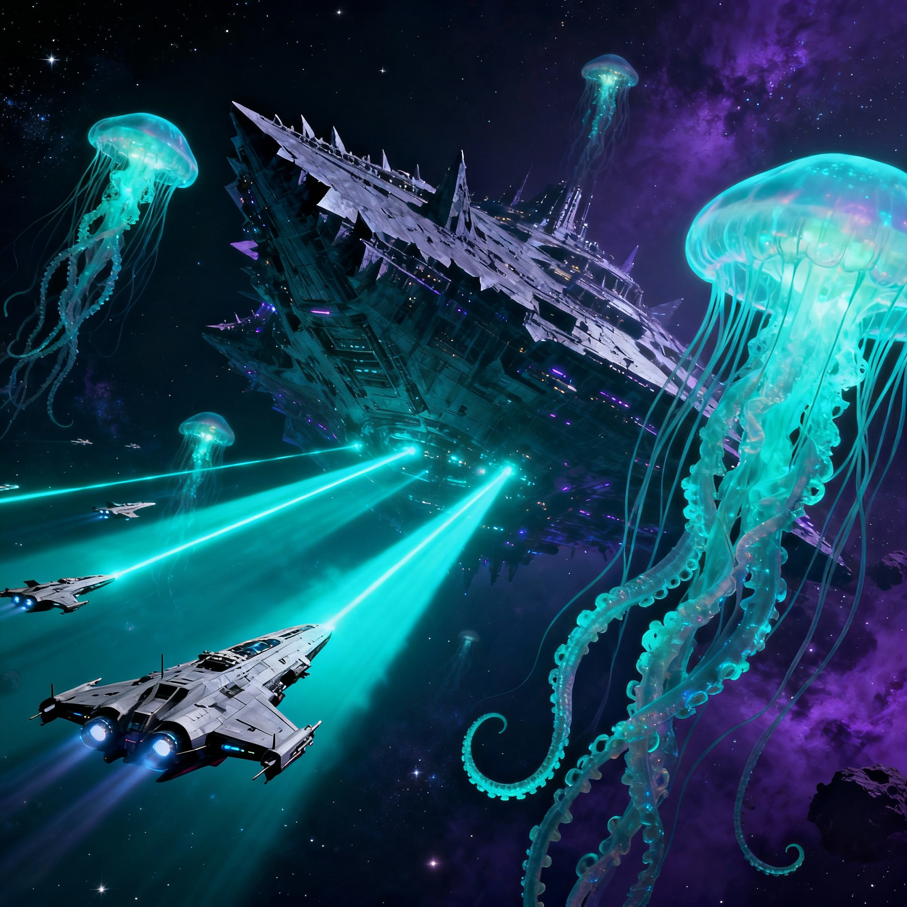
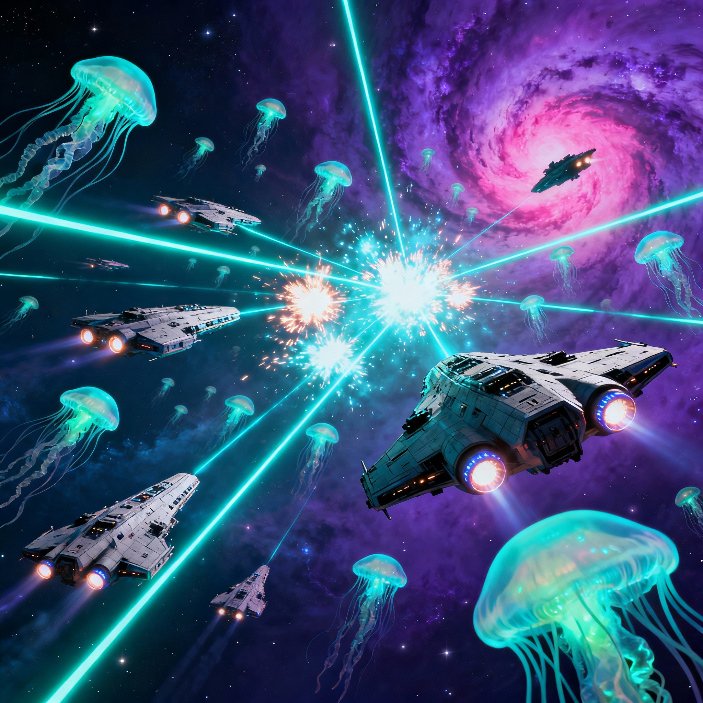
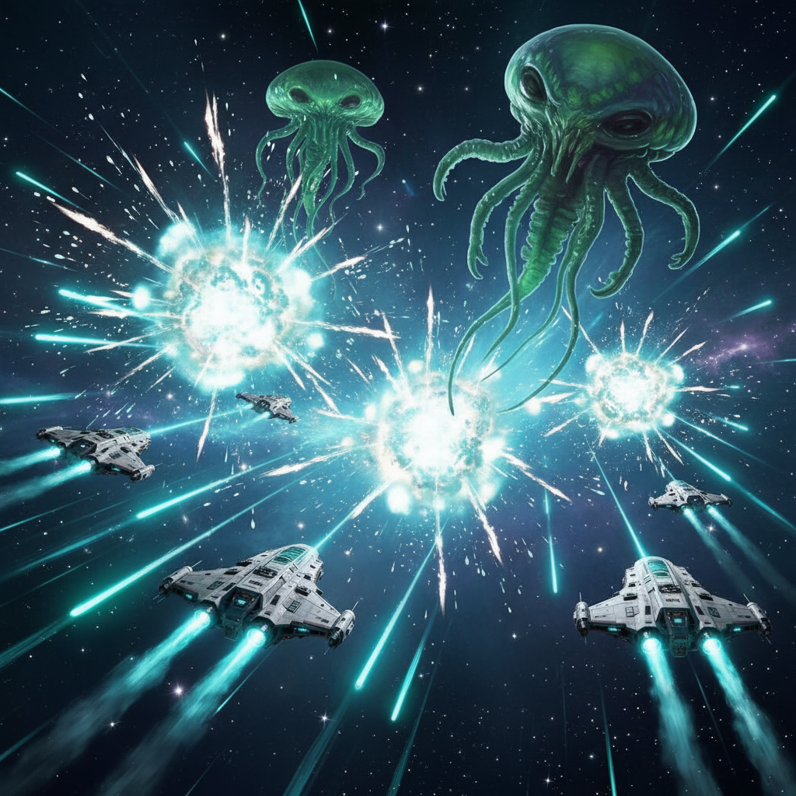
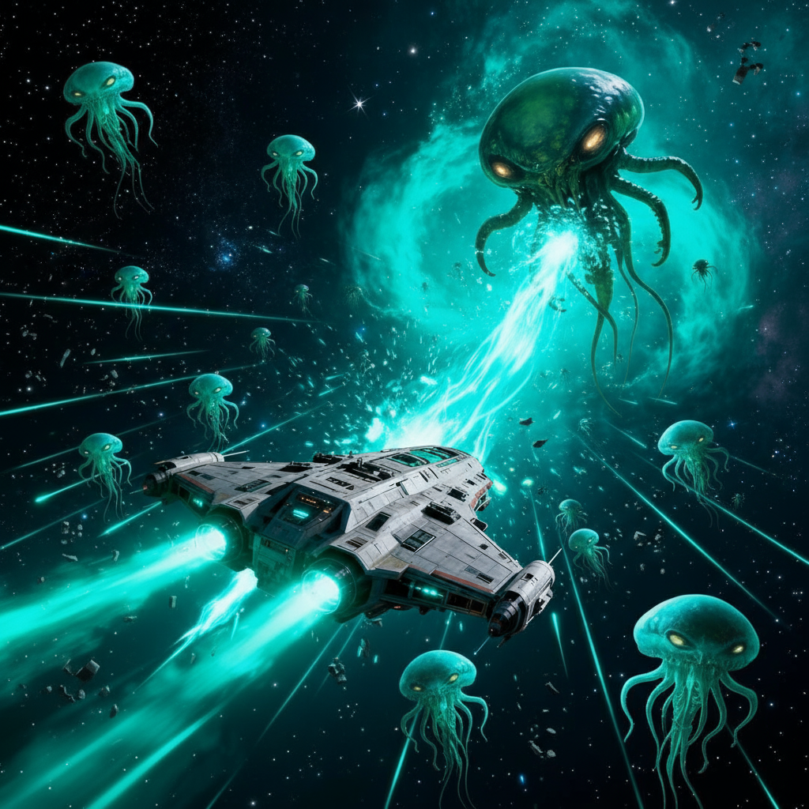
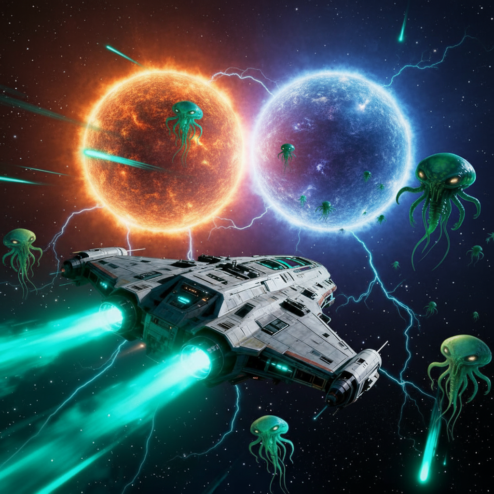
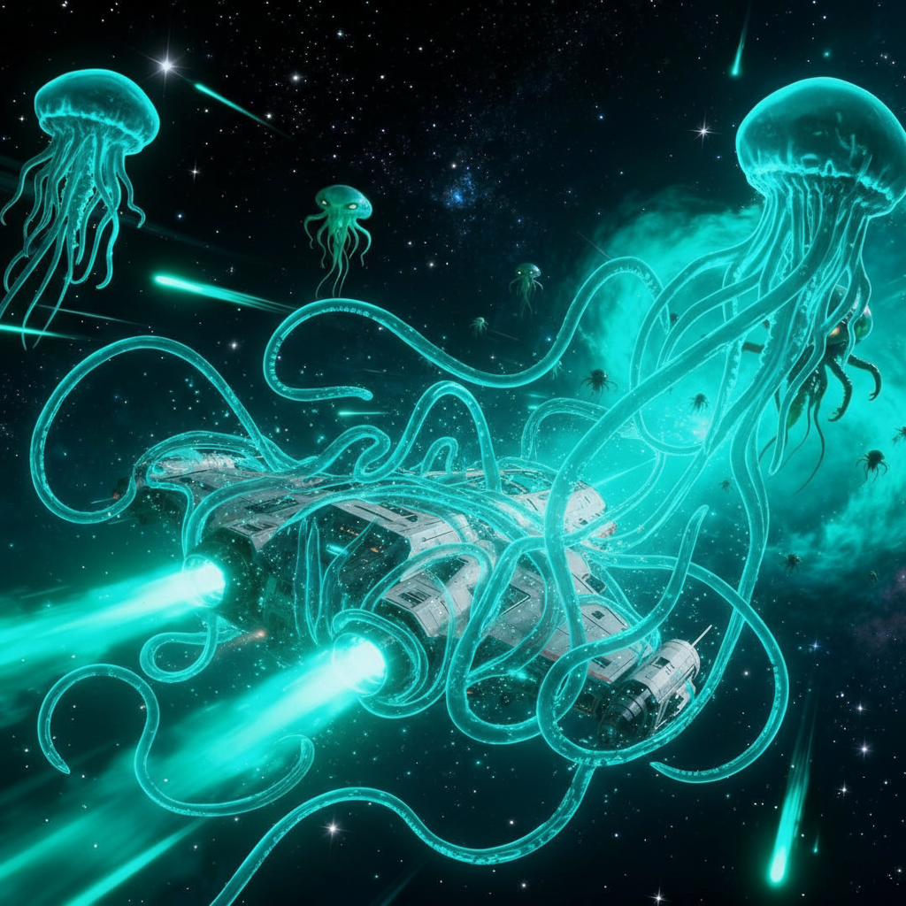
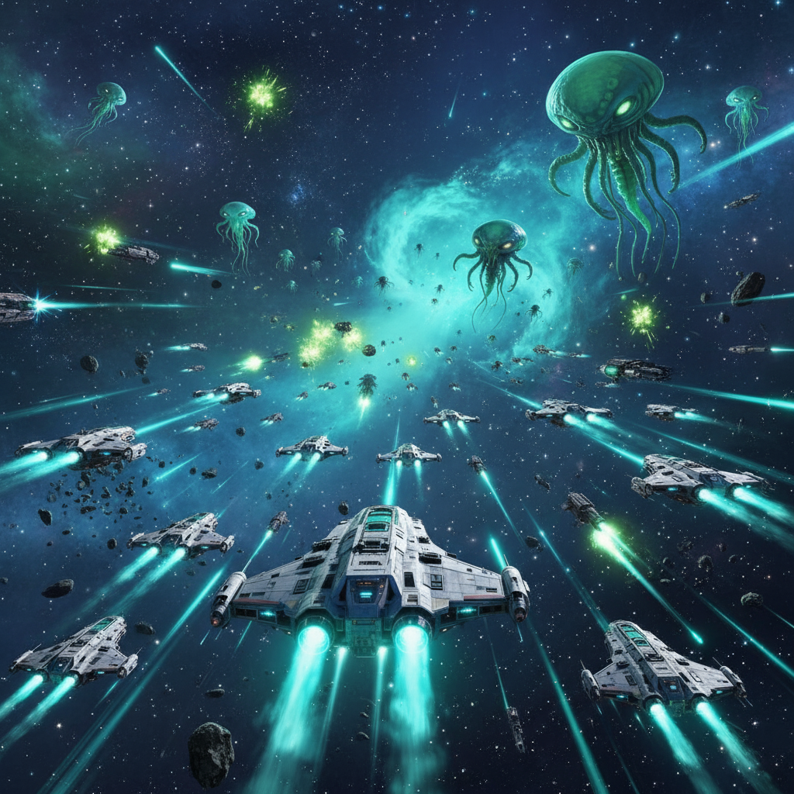

<div align="center">


# 👽 Alien Invaders — Space War

### Υπερασπίσου τον Γαλαξία από τους Εξωγήινους Εισβολείς

An intense, browser-based vertical arcade shoot-'em-up built in **pure vanilla JavaScript** — no frameworks, no build step. Procedural 8-bit music, hand-drawn-by-code bosses, a global leaderboard, and full mobile support.

[](https://konskall-ai.github.io/alieninvaders/)
&nbsp;


*Created by **KonsKall** — for my little boy.* 🚀

</div>

---

## 📖 Table of Contents

- [The Story](#-the-story--ο-κύκλος-του-κενού)
- [Features at a Glance](#-features-at-a-glance)
- [How to Play](#-how-to-play)
- [Game Systems](#-game-systems)
  - [Enemies](#enemies)
  - [Bosses](#bosses)
  - [Power-ups & Pickups](#power-ups--pickups)
  - [Combos & Scoring](#combos--scoring)
  - [Super Weapon](#super-weapon)
  - [Waves & Difficulty](#waves--difficulty)
- [Leaderboard](#-leaderboard)
- [Artwork Gallery](#-artwork-gallery)
- [Tech Stack](#-tech-stack)
- [Project Structure](#-project-structure)
- [Run It Locally](#-run-it-locally)
- [Deployment](#-deployment)
- [Credits & License](#-credits--license)

---

## 🌌 The Story — *Ο Κύκλος του Κενού*

> In 2026, the **Xenophage Collective** — an ancient cosmic empire — awakened. Humanity's first transmission to the stars *was the signal that roused them.*
>
> The enemy came in waves: **Scout Drones**, then **Fighter Wasps**. Cities burned. Nations fell. Humanity united.
>
> The skies filled with **Alien Leviathans** — creatures of pure cosmic energy. And then *they* came... the **Void Entities**, beings that defy reality itself.
>
> Chrome-hulled starships answered, armed with the most advanced technology mankind had ever forged. Each victory, a breath of hope.
>
> We haven't won yet... but we still stand. A fragile **Strategic Equilibrium**. The war goes on.

You pilot one of those starships. Hold the line.

---

## ✨ Features at a Glance

- 🛸 **8 distinct enemy types** with unique designs, behaviors, and weapons — all rendered procedurally on canvas (no sprite assets).
- 👾 **5 unique bosses** that cycle every 10 waves, each with two combat phases, homing fire, threshold drops, and minion reinforcements.
- 💥 **Charge-up Super Weapon** that clears the screen with an expanding shockwave.
- ⚡ **5 power-ups** — Shield, Health, Rapid Fire, Multi-Shot, and Score Multiplier — plus a **combo / critical-hit** system.
- 🎚️ **4 difficulty levels** (Very Easy → Hard) and a **100-level progressive scaling** curve.
- 🎵 **Real-time procedural 8-bit chiptune music** (110–155 BPM) and ~9 synthesized sound effects — zero audio files.
- 📳 **Haptic feedback** via the Vibration API on mobile.
- 🏆 **Global leaderboard** (Firebase Realtime Database, top 10) with localStorage fallback and one-tap **score sharing**.
- 📱 **Fully responsive** — keyboard on desktop, virtual joystick + touch buttons on mobile.
- 📦 **Installable PWA** — add it to your home screen and play offline (gameplay; leaderboard needs a connection).
- 🇬🇷 **Greek-language UI**, story mode, and an in-game artwork gallery.

---

## 🎮 How to Play

The goal: survive endless waves of invaders, defeat the bosses, and climb the leaderboard. **Auto-fire is on by default** — focus on dodging and positioning.

### ⌨️ Desktop

| Action | Control |
|---|---|
| Move | `Arrow Keys` or `W` `A` `S` `D` |
| Fire | Automatic *(or `Space` if auto-fire is turned off)* |
| Super Weapon | `S` *(when fully charged)* |
| Pause | `P` |

> ℹ️ When **Auto-Fire** is disabled in Settings, the `S` key still triggers the Super Weapon — use `Space` to shoot.

### 📱 Mobile

| Action | Control |
|---|---|
| Move | Drag your finger **anywhere** on screen, or use the virtual joystick (bottom-right) |
| Fire | Automatic |
| Super Weapon | Tap the **💥** button (bottom-left) |

### ⚙️ Settings

Difficulty, joystick visibility, **joystick sensitivity** (auto-calibrated per screen size), auto-fire, sound, and vibration are all configurable from the in-game Settings screen and persisted in your browser.

---

## 🧩 Game Systems

### Enemies

Eight enemy types unlock as you progress. Each has its own silhouette, movement pattern (straight, sine-wave, or homing), projectile, and on-screen health bar.

| Enemy | Unlocks | HP | Speed | Points | Signature |
|---|---|---:|---:|---:|---|
| 🛰️ **Scout Drone** | Lvl 1 | 2 | 4.0 | 10 | Cyan insectoid, single shot — the most common foe |
| 🐝 **Fighter Wasp** | Lvl 1 | 3 | 3.5 | 25 | Orange fighter, 40% chance of spread fire |
| 🚀 **Heavy Cruiser** | Lvl 1 | 5 | 2.5 | 50 | Purple armored battleship with turrets |
| 📡 **Swarm Commander** | Lvl 4 | 8 | 2.5 | 120 | Golden hexagonal command ship |
| 🛡️ **Elite Guardian** | Lvl 5 | 8 | 3.0 | 150 | Fast light-blue diamond with wing fins |
| 🐙 **Alien Leviathan** | Lvl 6 | 20 | 1.5 | 200 | Pink tentacled organic creature |
| 🏛️ **Behemoth Dreadnought** | Lvl 8 | 25 | 2.0 | 100 | Magenta mega-structure tank |
| 🌑 **Void Entity** | Lvl 12 | 25 | 1.0 | 300 | Rarest & slowest — crimson distortion ring, highest value |

*HP, damage, and spawn rates are scaled by the chosen difficulty (see below).*

### Bosses

A boss appears on **every 10th wave** (10, 20, 30 …). The five designs cycle as you go deeper, growing tougher each time.

| # | Boss | Appearance |
|---|---|---|
| 1 | 👑 **Void Overlord** | Magenta hexagon with a pulsing, rotating core |
| 2 | 🐙 **Xenophage Prime** | Purple octopus with six writhing tentacles |
| 3 | 🐉 **Leviathan King** | Teal elongated diamond with shimmer rings |
| 4 | ⚔️ **Dark Commander** | Orange-red four-spike crystal |
| 5 | ⭐ **Omega Destroyer** | Gold eight-point star with counter-rotating rings |

**Boss mechanics:**

- **Scaling** — Health = `300 × bossLevel × difficulty`; reward = `5000 × bossLevel`.
- **Two phases** — At **50% HP** the boss enters Phase 2: faster movement, 5-bullet spreads instead of 3, an added **homing projectile**, and a menacing strobe/flicker.
- **Threshold drops** — Pickups rain down as you damage it: ⚡ at **75%**, ❤️🛡️ at **50%**, and ❤️🛡️⚡ at **25%**.
- **Death drops** — A defeated boss always grants **Health + Shield + Rapid Fire**.
- **Reinforcements** — Regular enemies warp in every ~9 seconds during the fight (`⚠ REINFORCEMENTS!`).
- A **`👾 BOSS INCOMING 👾`** banner and a dedicated boss health bar warn you before each encounter.
- The Super Weapon deals a flat **30% of the boss's max HP** — save it for the right moment.

### Power-ups & Pickups

Defeated enemies have a **35% chance** to drop a glowing pickup. Bosses drop them on a guaranteed schedule. Uncollected pickups drift down and fade after ~8 seconds (and gently home toward you when close).

| Icon | Power-up | Effect | Duration | Drop chance |
|:---:|---|---|---|---:|
| 🛡️ | **Shield** | Absorbs one hit (bullet or collision) | 15 s | 25% |
| ❤️ | **Health** | Restores 1 life (max 3) | Instant | 20% |
| ⚡ | **Rapid Fire** | Doubles fire rate (150 ms → 75 ms) | 10 s | 15% |
| 🔱 | **Multi-Shot** | Dual shot → triple spread shot | 10 s | 15% |
| ⭐ | **Score Multiplier** | 2× points per kill | 15 s | 25% |

Active bonuses appear as a live icon stack with countdown timers.

### Combos & Scoring

Chaining kills without taking damage builds a **combo multiplier**:

- **3+ kills** → `CRITICAL!` hit text appears above defeated enemies.
- **5+ kills** → **1.5×** score multiplier (and a `KILLING SPREE` banner every 5th kill).
- **10+ kills** → **2.0×** score multiplier.

Taking damage resets your combo. Final points stack like so:

```
points = floor( basePoints × scoreMultiplierBonus(2×) × comboMultiplier(up to 2×) )
```

Clearing every enemy in a (non-boss) wave grants a **Wave Clear bonus** of `500 × waveNumber`.

### Super Weapon

Every kill feeds your Super Weapon gauge by that enemy's point value. At **650 charge** it's ready: trigger it with `S` (desktop) or the **💥** button (mobile) to unleash a screen-clearing shockwave that wipes all enemy bullets, blasts nearby foes, and chunks **30%** off any boss's health. Then the gauge resets to zero.

### Waves & Difficulty

Waves spawn `min(6 + (wave−1) × 2, 20)` enemies, with a 3-second breather between them. Enemy variety and toughness ramp up across a **100-level** progressive curve (visualized by a color-coded difficulty indicator, green → purple).

Four difficulty presets reshape the whole experience:

| Difficulty | Spawn Rate | Enemy HP | Enemy DMG | Score | Boss Frequency | Your Fire Rate |
|---|:---:|:---:|:---:|:---:|:---:|:---:|
| 🟢 **Very Easy** | 0.45× | 0.35× | 0.25× | 1.0× | 0.15× | 3.0× |
| 🟡 **Easy** *(default)* | 0.70× | 0.60× | 0.45× | 1.0× | 0.30× | 2.0× |
| 🟠 **Normal** | 1.00× | 1.00× | 1.00× | 0.7× | 1.00× | 1.0× |
| 🔴 **Hard** | 1.40× | 1.30× | 1.50× | 0.5× | 1.80× | 0.65× |

> Tougher settings hit harder **and** pay less per kill — but bring on the bosses faster.

---

## 🏆 Leaderboard

Scores are saved to a **Firebase Realtime Database** (region `europe-west1`) and the **top 10** are displayed live, with 🥇🥈🥉 medals for the podium and each entry showing the player's name, reached level, date, and score. If Firebase is unavailable, the game transparently falls back to **localStorage** so your best run is never lost.

After a game over you can **share your score** to Facebook or copy it to your clipboard, with a celebratory message that scales with how far you got.

> 🔒 The Firebase web config lives in `app.js`. Web API keys are *designed to be public* for client-side Firebase apps — access is governed by the database's security rules, not by hiding the key.

---

## 🖼️ Artwork Gallery

The game ships with an in-app **Artwork Gallery** of concept pieces. A taste:

<div align="center">

| | | |
|:---:|:---:|:---:|
| <br>**Xenophages** | <br>**Mothership** | <br>**Battle of the Singularity** |
| <br>**Ultimate Attack** | <br>**Neutrino Laser Beam** | <br>**Two Suns** |
| <br>**Deadly Tentacles** | <br>**Nova Battleship** | <br>**Assemble the Army** |

</div>

*See the full set in [`/Gallery`](Gallery) or via the in-game **Artwork** button.*

---

## 🛠️ Tech Stack

Built deliberately with **zero dependencies to install and no build step** — just static files.

| Area | Technology |
|---|---|
| **Language** | Vanilla JavaScript (ES6+), a single ~4,700-line `app.js` |
| **Rendering** | HTML5 `<canvas>` 2D — procedural ships, particles, shockwaves, parallax starfield (240 stars, 3 layers) |
| **Audio** | Web Audio API — real-time chiptune music engine + ~9 synthesized SFX (no audio files) |
| **Haptics** | Vibration API (`navigator.vibrate`) |
| **Backend** | Firebase Realtime Database (compat SDK v10.7.2 via CDN) for the leaderboard |
| **Persistence** | `localStorage` for settings + offline leaderboard fallback |
| **Styling** | Hand-written CSS design system (`style.css`) + Google Fonts (*Orbitron*, *Russo One*) |
| **App shell** | PWA `site.webmanifest`, maskable icons, OpenGraph / Twitter Card metadata |
| **Hosting** | GitHub Pages *(a `netlify.toml` for Netlify is also included)* |

**Performance touches:** gradient caching, shadow-blur culling above an enemy threshold, off-screen particle culling, capped shockwaves, and in-place array updates — all to hold 60 fps on mid-range mobile.

---

## 📁 Project Structure

```
alieninvaders/
├── index.html                 # Markup: screens, HUD, canvas, touch controls, modals
├── app.js                     # The entire game engine (~4,700 lines)
├── style.css                  # Design system, responsive layout, animations
├── site.webmanifest           # PWA manifest
├── netlify.toml               # Netlify hosting config
├── Gallery/                   # Concept artwork (PNG)
├── og-alien.png               # Social share / hero image
├── alieninvadersfb.png        # Facebook share image
├── favicon.svg / .ico / *.png # Favicons & touch icons
└── web-app-manifest-*.png     # PWA install icons (192px, 512px)
```

---

## 💻 Run It Locally

No toolchain required — it's static files. Because the browser loads modules and Firebase over HTTP(S), serve the folder rather than opening `index.html` from disk:

```bash
git clone https://github.com/konskall/alieninvaders.git
cd alieninvaders

# Pick any static server:
python -m http.server 8000          # Python 3
# or
npx serve .                          # Node
# or use the VS Code "Live Server" extension
```

Then open **http://localhost:8000**.

> An internet connection is needed for Google Fonts and the Firebase leaderboard; core gameplay works offline.

---

## 🚀 Deployment

The game is a static site and deploys anywhere that serves files.

- **GitHub Pages** — enable Pages on this repo (branch `main`, root). Live at: **https://konskall-ai.github.io/alieninvaders/**
- **Netlify** — `netlify.toml` is included; connect the repo and deploy, no build command needed.

---

## 🙏 Credits & License

Created with love by **KonsKall** — *for my little boy.* 👦💙

Fonts by [Google Fonts](https://fonts.google.com/) (*Orbitron*, *Russo One*). Leaderboard powered by [Firebase](https://firebase.google.com/).

> No license file is currently included. If you'd like others to reuse this code, consider adding one (e.g. [MIT](https://choosealicense.com/licenses/mit/)). Until then, all rights are reserved by the author.

<div align="center">

**[▶ Play Alien Invaders](https://konskall-ai.github.io/alieninvaders/)**

*Hold the line. The war goes on.* 👽⚔️

</div>
